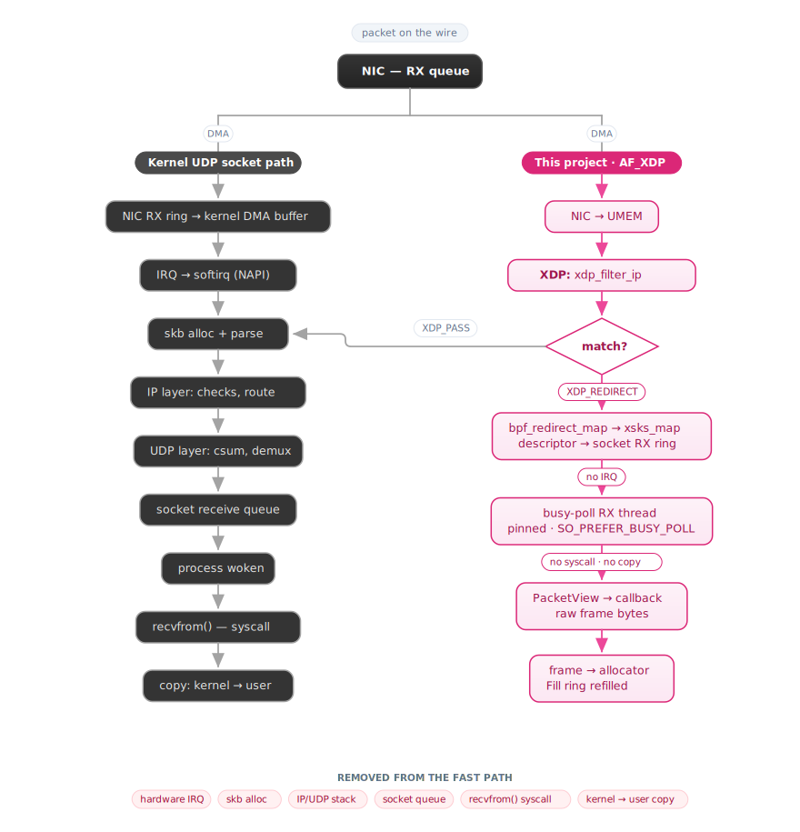

# afxdp_receiver

Kernel-bypass packet I/O on Linux: an AF_XDP receive/transmit engine in C++23, with an eBPF/XDP program steering selected traffic from the NIC directly into userspace memory.

The point of the project is the latency toolbox: kernel bypass, zero-copy DMA buffers, lock-free rings, busy-polling instead of interrupts, huge pages, CPU pinning, and no heap allocation on the hot path.

## Packet path



Non-matching traffic never leaves the normal kernel path, so the machine stays reachable (SSH, etc.) while the engine owns its target flow.

## What's inside

| Piece | File | The interesting bit |
|---|---|---|
| XDP filter | `xdp_prog_bpf.c` | In-kernel classification: Ethernet → up to two stacked VLAN tags (802.1Q/802.1ad) → IPv4 source match. Hits are redirected to the AF_XDP socket; everything else `XDP_PASS`es. The filter IP lives in a BPF array map, so it's swappable at runtime without reattaching the program. |
| UMEM | `umem.hpp` | One mmap'd 16 MB region (8192 × 2048 B frames), 2 MB huge pages with automatic 4 KB fallback, mlocked. |
| Rings | `ring.hpp` | One template over all four AF_XDP rings (RX/TX/Fill/Completion). `std::atomic_ref` with acquire/release ordering on the kernel-shared head/tail words; producer/consumer indices are cached locally and re-read from shared memory only when the cached view runs dry. |
| Frame allocator | `frame_alloc.hpp` | Fixed-capacity LIFO stack of UMEM frame offsets, O(1) alloc/free, zero heap after startup. |
| Socket setup | `xsk.hpp` | `XDP_ZEROCOPY` bind with automatic copy-mode fallback; NAPI busy-polling via `SO_PREFER_BUSY_POLL` (budget 64, 20 µs timeout (hardcoded)). |
| BPF loader | `xdp_loader.hpp` | libbpf attach — native (driver) mode first, generic (SKB) fallback. |
| Receiver | `receiver.hpp` | Pinned, optionally `SCHED_FIFO` polling thread; 64-frame batches; hands each frame to a user callback as a raw byte span; refills the Fill ring past a threshold. |
| Transmitter | `transmitter.hpp` | TX ring producer plus completion reaping; frames return to the allocator. |

Error handling is `std::expected` end to end; there are no exceptions.

## Current scope

Single RX queue, single socket, IPv4-only filtering. The receive callback gets raw Ethernet frames, there is no userspace protocol stack built on top. The bundled callback is a reflector benchmark: it counts packets/bytes and echoes each matched frame back out the TX ring, with counters (`bench_pkts`, `bench_bytes`, `bench_echoed`) reported on the once-a-second stats line.

## Performance

Not yet measured, working confirmed via veth.

| Metric | Status |
|---|---|
| Median processing latency vs. kernel UDP socket | pending |
| p99 round-trip latency under sustained load | pending |
| Sustained throughput (packets/sec) | pending |

## Build & run

```bash
cmake -S . -B build && cmake --build build
sudo ./build/afxdp_receiver -i <iface> -f <source_ip_to_capture>
```

Needs Linux ≥ 5.11, GCC ≥ 14, clang, CMake ≥ 3.20, libbpf-dev. Full walkthrough (including the veth-based test setup that needs no physical NIC) in [`BUILD_AND_TEST.md`](docs/BUILD_AND_TEST.md).

## License

MIT, except `xdp_prog_bpf.c`, which is GPL-2.0-only (required by the BPF helpers it uses). Full text in [`LICENSE`](LICENSE).
