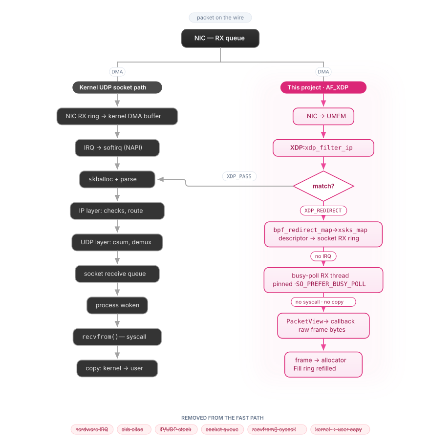

# afxdp_receiver

An AF_XDP receive/transmit engine in C++23 for a controlled Linux/x86-64 environment, with an eBPF source-IP filter and a UDP reflector benchmark.

One worker owns the rings and frame allocator. The design uses preallocated UMEM, SPSC rings, CPU pinning, bounded I/O maintenance, and no heap allocation on the hot path. Zero-copy and huge pages are requested by default, with fallbacks.

## Packet path



The diagram illustrates the native zero-copy receive path. Runtime wakeup syscalls and IRQ behavior depend on configuration; reflected frames return to the allocator through TX completion before reuse.

Non-matching traffic never leaves the normal kernel path, so the machine stays reachable (SSH, etc.) while the engine owns its target flow.

## What's inside

| Piece | File | The interesting bit |
|---|---|---|
| XDP filter | `xdp_prog_bpf.c` | In-kernel classification: Ethernet → up to two stacked VLAN tags (802.1Q/802.1ad) → IPv4 source match. Hits are redirected to the AF_XDP socket; everything else `XDP_PASS`es. The filter IP lives in a BPF array map, so it's swappable at runtime without reattaching the program. |
| UMEM | `umem.hpp` | One mmap'd 16 MiB region (8192 × 2048 B frames), huge-page allocation with anonymous-mapping fallback, mlocked. |
| Rings | `ring.hpp` | Four SPSC rings with cached indices, readable/writable windows, and acquire/release publication through `std::atomic_ref`. |
| Frame allocator | `frame_alloc.hpp` | Fixed-capacity LIFO stack of UMEM frame offsets, O(1) alloc/free, zero heap after startup. |
| Socket setup | `xsk.hpp` | `XDP_ZEROCOPY` bind with automatic copy-mode fallback; NAPI busy-polling via `SO_PREFER_BUSY_POLL` (budget 64, 20µs timeout (hardcoded)). |
| BPF loader | `xdp_loader.hpp` | libbpf attach - native (driver) mode first, generic (SKB) fallback. |
| Receiver | `receiver.hpp` | Pinned, optionally `SCHED_FIFO` polling thread; 64-frame batches; hands each frame to a user callback as a raw byte span; refills the Fill ring past a threshold. |
| Transmitter | `transmitter.hpp` | Stages and publishes RX frames in place; retries outstanding TX and reclaims frames through CQ. |

I/O setup and progress errors use `std::expected`; allocation and cold-path formatting can throw.

## Current scope

Single RX queue, single socket, IPv4-only filtering. The receive callback gets raw Ethernet frames. The bundled reflector expects known unicast peers, valid input checksums, untagged IPv4/UDP, a 20-byte IPv4 header, no fragmentation, and an IPv4 MTU of 1500. It swaps endpoints while preserving checksums. Unsupported layouts are counted and recycled. The XDP source-IP filter is broader than this callback's packet contract.

Reports distinguish RX processing, TX staging, TX publication, CQ reclamation, and rejected frames. After shutdown, `callback_tx_staging_ns.csv` contains sorted callback/staging samples and `run_metadata.txt` retains build settings, operating modes, counters, and outcome. See [Benchmarking](docs/BENCHMARKING.md) for counter meanings and measurement limits.

## Performance

Not yet measured in a proper test environment; functionality confirmed via veth (COPY mode only).

## Build & run

```bash
cmake -S . -B build -DCMAKE_CXX_COMPILER=g++-14 -DCMAKE_BUILD_TYPE=Release
cmake --build build --parallel 1
cd build
sudo ./afxdp_receiver -i eth0 -f 192.0.2.10
```

Replace the interface and source IP with your flow. Run from the directory containing `xdp_prog.bpf.o`. Requires Linux/x86-64 with AF_XDP and busy-poll socket options, GCC ≥ 14, clang with a BPF backend, CMake ≥ 3.20, pkg-config, and libbpf development files. Build and UDP smoke-test instructions are in [Build & Test](docs/BUILD_AND_TEST.md).

## License

MIT, except `xdp_prog_bpf.c`, which is GPL-2.0-only (required by the BPF helpers it uses). Full text in [`LICENSE`](LICENSE).

## Note on AI usage

Everything that has to do with benchmarking (that is: bench.hpp, and parts of main with extensive commenting [strategy and load lambdas]) were entirely written by fable 5, as I do not yet have the hardware to test and benchmark this extensively down to the nanos, when the time comes I'll work through it myself though. :D

Also the .md-s and most of the readme were of course written by AI, along with the C code (xdp_prog_bfc.c).

Nontheless the entirity of the infrastructure and all logical elements - that is: 8 implementation headers and main.cpp - are custom designed and built by me.
